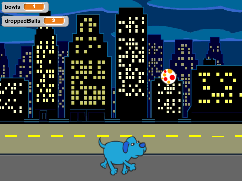

## Introduction

In this project, we are going to create a game in which Toby the dog has to collect 5 cheese-puffs bowls to win, whilst preventing balls from falling on the floor. 
If Toby drops more than 2 balls, the game is over. So the question is: can you keep all the balls in the air?

  <iframe allowtransparency="true" width="485" height="402" src="https://scratch.mit.edu/projects/embed/49677948/?autostart=false" frameborder="0"></iframe>
  

### Additional information for club leaders

If you need to print this project, please use the [Printer friendly version](./print).

--- collapse ---
---
title: Project materials
---

## Club leader resources
* [Downloadable completed Scratch 2 project](resources/Toby.sb2)

--- /collapse ---