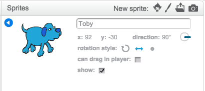

## Controlling Toby


+ Start a new Scratch project. Delete the cat by right-clicking it and selecting Delete.

+ Click on the stage. Choose a backdrop from the Scratch library: the **night city with street** backdrop is a good choice for this project. Delete the original blank backdrop.

+ Add a new sprite. select the **Dog2** sprite from the **Animals** section.

+ **Dog2** comes with three costumes. Delete the third costume **dog2-c** as we only want the first two.

+ Click on the blue `i`{:class="blockmotion"} button to the top left of the sprite picture. Rename the sprite __Toby__ 

+ Select the `left-right rotation style`{:class="blockmotion"} as shown on the picture below:

	

+ We want Toby to move right when we press the right arrow key. Click on the scripts tab, and add this script:

	```blocks
		when FLAG clicked    
		switch backdrop to [night city with street v]   
		forever
		if <key [right arrow v] pressed?> then
		point in direction (90 v)
		move (10) steps
		next costume
		end
		end            
	```


+ Click on the Green Flag, and check that Toby can move right when you press the right arrow key. Now we need to add more code to allow Toby to move left as well. Add this to your script:

	```blocks
    		when FLAG clicked    
		switch backdrop to [night city with street v]   
        	forever
	   	if <key [right arrow v] pressed?> then
		point in direction (90 v)
		move (10) steps
		next costume
	   	end	
           	if <key [left arrow v] pressed?> then
		point in direction (-90 v)
		move (10) steps
		next costume
	   	end
       		end            
	```

## Test Your Project
 
__Click the green flag__, press the left arrow key. Does Toby move left ? Now try the right arrow key!


