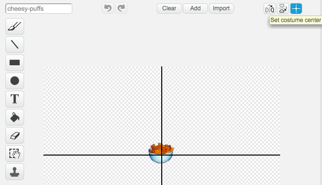

## Keeping Toby busy!

Now that Toby can move, let's give him something to do. In order to win the game, Toby must collect 5 cheese-puffs bowls. We need the bowls to appear randomly at different times and places.


+ Add a new sprite from the library: select the **cheesy-puffs** from the **Things** category, and rename it **bowl**. 

+ Click on the __Costumes__ tab and reduce the size of the cheese-puffs bowl by clicking on the **shrink** icon at the top near the scissors. You then need to click on the bowl sprite to make it smaller. The shrink icon looks like this:

	


+ If you used a different method to resize the bowl, you may need to reset the centre of the costume so that it is at the centre of the bowl. To do this, click on the **Set costume centre** icon at the top right corner, and move the crosshair as shown on the picture below:  

	


+ The **cheesy-puffs** need to appear in random places on the pavement. The `y position`{:class="blockmotion"} will remain the same, but the `x position`{:class="blockmotion"} needs to change so that the bowl sometimes appears on the right, on the left, or in the middle. Add the following script to the **bowl** sprite: 

	```blocks
		when FLAG clicked  
		forever
		wait (5) secs
		go to x:(pick random (-220) to (220)) y:(-140)
		end
	```

+ Click the green flag, and wait for a bit. Does the cheese-puffs bowl keep moving to different places every 5 seconds?

+ At the moment, the game is too predictable! Let's make it more difficult by hiding the bowl from time to time. Modify the script in the following way:

	```blocks
		when FLAG clicked  
		hide
		forever
		wait (pick random (1) to (10)) secs
		go to x:(pick random (-220) to (220)) y:(-140)
		show
		wait (pick random (1) to (10)) secs
		hide
		end
	```

## Test Your Project


__Click the green flag__, the cheese-puffs bowl should now appear for random lengths of time, and in random places.


