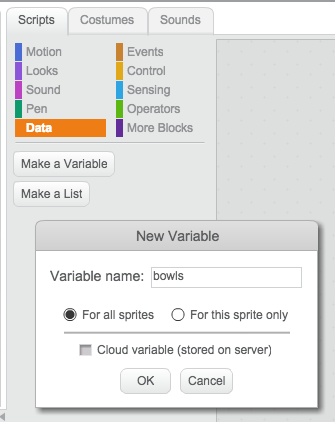

## Counting the bowls

In order to win the game, Toby must collect 5 cheese-puffs bowls. 


+ Create a `bowls`{:class="blockdata"} variable to keep track of how many bowls Toby has collected so far.

	

+ Now we need to add some code to keep track of how many bowls Toby has collected so far. Each time that Toby touches a cheese-puffs bowl, the `bowls`{:class="blockdata"} variable needs to be increased by 1. So add this script to the cheese-puffs bowl sprite. (Make sure that you keep the previous script as well! We need both scripts)

	```blocks
    		when FLAG clicked  
		set [bowls v] to (0)
        	forever
	  	if <touching [Toby v]?> then
	    	change [bowls v] by (1)
		wait (0.5) secs
		hide
  	  	end	
		end
	```
 
+ The game should be stopped when the number of bowls collected reaches 5. We are going to broadcast a new message called `won`{:class="blockevents"} to the other sprite and the background to let them know that the player has won.
Modify your second script so that it looks like this:

	```blocks
		when FLAG clicked  
		set [bowls v] to (0)
        	forever
		if <touching [Toby v]?> then		
		change [bowls v] by (1)
		if <(bowls) = (5)> then
		broadcast [won v]
		stop [other scripts in sprite v]
		end
		wait (0.5) secs		
		hide
		end	
		end    
	```

+ Add a small script for Toby so that he says 'well done!' when he receives the `won`{:class="blockevents"} message:

	```blocks
		when I receive [won v] 
		say [Well done !] for (2) secs 	     
	```

## Test Your Project

__Click the green flag__, does the `bowls`{:class="blockdata"} variable increase each time the dog collects a bowl? Does Toby say "well done" once 5 bowls have been collected?


## Challenge 1: Adding sound

+ Can you add some code to play a **pop** sound each time a bowl is collected?

+ Can you add a small script for the background so that it changes and plays music when the player wins? 

Hint: You will need to add a script for your stage starting with a `when I receive won`{:class="blockevents"} block
	


