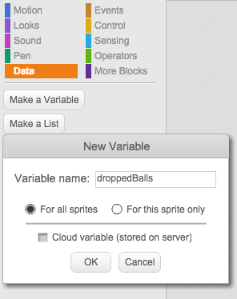

## Counting the dropped balls 


+ We now need to keep track of how many balls Toby has dropped so far. To do this, create a variable for all sprites called `droppedBalls`{:class="blockdata"}.

	

+ When we start the game, Toby has not dropped any balls yet, so we need to initialise the `droppedBalls`{:class="blockdata"} variable to 0. Each time the balls touches the floor, the `droppedBalls`{:class="blockdata"} variable needs to be increased by 1.
When the number of dropped balls is more than 3, the game is over, so we will broadcast a new message called `gameover`{:class="blockevents"} to tell the other sprites and the background that the game is over, and the player has lost. Your **Beachball** script should now look like this: 

	```blocks
		when FLAG clicked  
		set [droppedBalls v] to (0)
		show
 	 	go to x:(pick random (-220) to (220)) y:(160)
	 	point in direction (135 v)
	 	forever
	   	move (4) steps
	   	if on edge, bounce
	   	if <touching [Toby v]?> then
		turn right (pick random (90) to (270)) degrees
		move (100) steps
	   	end
 	   	if <(y position) < (-140)> then
		change [droppedBalls v] by (1)
		if <(droppedBalls) = (3)> then
		broadcast [gameOver v]
		hide
		stop [this script v]
		end	
		change [color v] effect by (25)
		go to x:(pick random (-220) to (220)) y:(160)
		play sound [water drop v]
		end
		end
	```

+ When the players wins, the game should stop, and the ball should stop bouncing and hide:

	```blocks
		when I receive [won v]
		hide
		stop [other scripts in sprite v]
	```


+ Add this script to your **bowl** sprite to stop it from appearing when the game is over:

	```blocks
		when I receive [gameOver v]
		stop [other scripts in sprite v]
	```

+ Click on the stage. Then click on the Sounds tab, and import the **spooky string** sound from the Scratch library, and the **triumph** sound. 

+ Add this script to the stage so that it plays a **spooky string** sound when the game is over:

	```blocks
		when I receive [gameOver v]
		change [color v] effect by (25)
		play sound [spooky string v]
	```
+ Add this script to the stage so that it changes colour several times and plays a **triumph** sound when the player wins:

	```blocks
		when I receive [won v]
		play sound [triumph v]
		repeat (12)
		change [color v] effect by (25)
		wait (0.5) secs
		end
	```
+ Finally, add this script to make sure the colour of the stage comes back to normal when the game is restarted.

	```blocks
		when FLAG clicked
		clear graphic effects
	```

## Test Your Project

__Click the green flag__, does the `droppedBalls`{:class="blockdata"} variable increase each time a ball is dropped? Test your game in as many ways that you can think of (winning and losing for example) Does it work as expected?

  


## Challenge 2: make the game more challenging

What could you do to make the game more challenging? Here are some suggestions:
+ Make the bowls hide more quickly, and for longer. Which parameters do you need to modify to achieve this?  
+ Make the ball move a lot faster, or add another ball: maybe it could be a basketball this time. You can copy the script from the beach ball onto the basketball using drag and drop, there is no need to rewrite the whole script...
+ You could make a level 2 for your game, with a different background, and more balls bouncing around. Instead of collecting cheese-puffs bowls, Toby could this time collect some donuts. (There is a **donut** sprite in the Scratch library). You could create a `level`{:class="blockdata"} variable to keep track of the level you're currently playing.

           


Well done, you have finished! Now you can enjoy your game!

Don't forget you can share your game with all your friends and family by clicking on **Share** on the menu bar!

